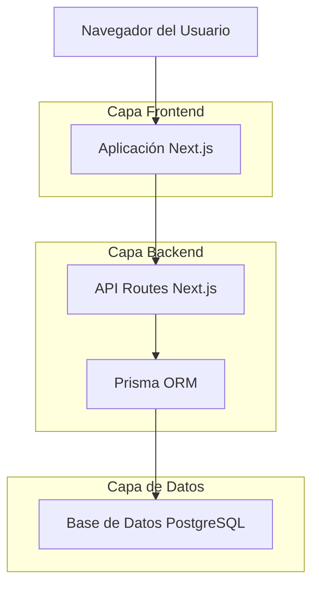
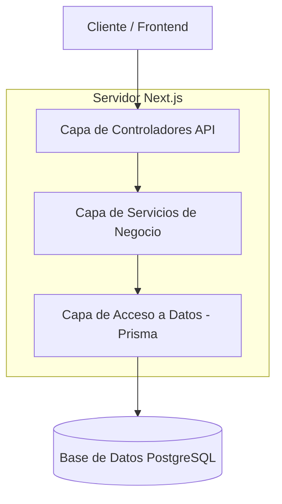
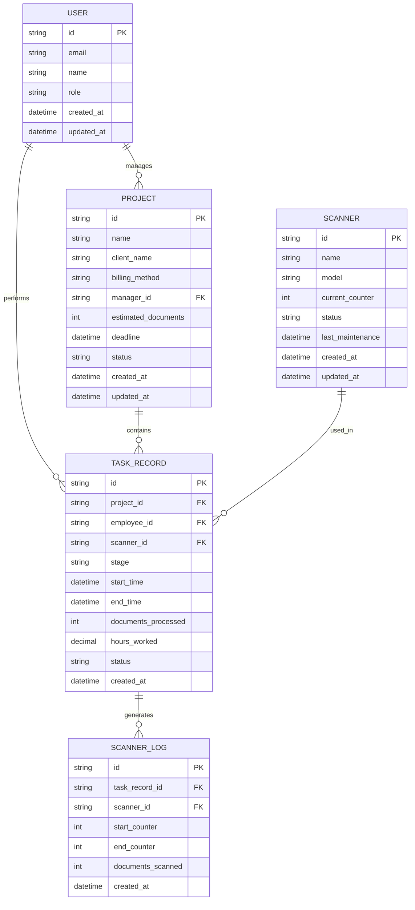

# Documento de Arquitectura Técnica - Sistema de Gestión y Seguimiento de Trabajo para Digitalización de Documentos

## 1. Diseño de Arquitectura



## 2. Descripción de Tecnologías

* **Frontend**: Next.js\@14 + React\@18 + TypeScript + Tailwind CSS\@3

* **Backend**: Next.js API Routes + Prisma ORM\@5

* **Base de Datos**: PostgreSQL\@15

* **Autenticación**: NextAuth.js

* **UI Components**: Radix UI + Lucide React

* **Gráficos**: Recharts

* **Validación**: Zod

## 3. Definición de Rutas

| Ruta                 | Propósito                                         |
| -------------------- | ------------------------------------------------- |
| /                    | Página de inicio con redirección a dashboard      |
| /login               | Página de autenticación de usuarios               |
| /dashboard           | Panel de control principal con métricas generales |
| /projects            | Gestión de proyectos - lista, creación, edición   |
| /projects/\[id]      | Detalles específicos de un proyecto               |
| /tasks               | Registro y seguimiento de tareas por empleado     |
| /tasks/scanner       | Interfaz específica para registro de escaneo      |
| /reports             | Generación de reportes y métricas                 |
| /reports/billing     | Reportes específicos de facturación               |
| /resources           | Gestión de empleados y equipos                    |
| /resources/employees | Administración de empleados                       |
| /resources/scanners  | Configuración y estado de escáneres               |
| /settings            | Configuración del sistema y parámetros            |

## 4. Definiciones de API

### 4.1 APIs Principales

**Autenticación de usuarios**

```
POST /api/auth/signin
```

Request:

| Nombre Parámetro | Tipo   | Requerido | Descripción            |
| ---------------- | ------ | --------- | ---------------------- |
| email            | string | true      | Email del usuario      |
| password         | string | true      | Contraseña del usuario |

Response:

| Nombre Parámetro | Tipo    | Descripción                   |
| ---------------- | ------- | ----------------------------- |
| success          | boolean | Estado de la autenticación    |
| user             | object  | Datos del usuario autenticado |
| token            | string  | Token de sesión               |

**Gestión de Proyectos**

```
POST /api/projects
GET /api/projects
PUT /api/projects/[id]
DELETE /api/projects/[id]
```

**Registro de Tareas**

```
POST /api/tasks
GET /api/tasks
PUT /api/tasks/[id]
```

**Métricas y Reportes**

```
GET /api/reports/productivity
GET /api/reports/billing/[projectId]
GET /api/reports/scanners
```

**Gestión de Recursos**

```
GET /api/employees
POST /api/employees
PUT /api/employees/[id]
GET /api/scanners
POST /api/scanners
PUT /api/scanners/[id]
```

Ejemplo de Request para crear proyecto:

```json
{
  "name": "Digitalización Archivo Municipal",
  "clientName": "Municipalidad de San Juan",
  "billingMethod": "per_document",
  "managerId": "user_123",
  "estimatedDocuments": 5000,
  "deadline": "2024-12-31"
}
```

## 5. Arquitectura del Servidor



## 6. Modelo de Datos

### 6.1 Definición del Modelo de Datos



### 6.2 Lenguaje de Definición de Datos (DDL)

**Tabla de Usuarios (users)**

```sql
-- Crear tabla de usuarios
CREATE TABLE users (
    id UUID PRIMARY KEY DEFAULT gen_random_uuid(),
    email VARCHAR(255) UNIQUE NOT NULL,
    password_hash VARCHAR(255) NOT NULL,
    name VARCHAR(100) NOT NULL,
    role VARCHAR(20) DEFAULT 'employee' CHECK (role IN ('admin', 'manager', 'employee')),
    created_at TIMESTAMP WITH TIME ZONE DEFAULT NOW(),
    updated_at TIMESTAMP WITH TIME ZONE DEFAULT NOW()
);

-- Crear índices
CREATE INDEX idx_users_email ON users(email);
CREATE INDEX idx_users_role ON users(role);
```

**Tabla de Proyectos (projects)**

```sql
-- Crear tabla de proyectos
CREATE TABLE projects (
    id UUID PRIMARY KEY DEFAULT gen_random_uuid(),
    name VARCHAR(200) NOT NULL,
    client_name VARCHAR(200) NOT NULL,
    billing_method VARCHAR(20) NOT NULL CHECK (billing_method IN ('per_document', 'per_hour')),
    manager_id UUID NOT NULL,
    estimated_documents INTEGER,
    deadline DATE,
    status VARCHAR(20) DEFAULT 'active' CHECK (status IN ('active', 'completed', 'paused', 'cancelled')),
    created_at TIMESTAMP WITH TIME ZONE DEFAULT NOW(),
    updated_at TIMESTAMP WITH TIME ZONE DEFAULT NOW()
);

-- Crear índices
CREATE INDEX idx_projects_manager_id ON projects(manager_id);
CREATE INDEX idx_projects_status ON projects(status);
CREATE INDEX idx_projects_deadline ON projects(deadline);
```

**Tabla de Registros de Tareas (task\_records)**

```sql
-- Crear tabla de registros de tareas
CREATE TABLE task_records (
    id UUID PRIMARY KEY DEFAULT gen_random_uuid(),
    project_id UUID NOT NULL,
    employee_id UUID NOT NULL,
    scanner_id UUID,
    stage VARCHAR(30) NOT NULL CHECK (stage IN ('reception', 'preparation', 'scanning', 'indexing', 'quality_control', 'reassembly', 'delivery')),
    start_time TIMESTAMP WITH TIME ZONE NOT NULL,
    end_time TIMESTAMP WITH TIME ZONE,
    documents_processed INTEGER DEFAULT 0,
    hours_worked DECIMAL(5,2) DEFAULT 0,
    status VARCHAR(20) DEFAULT 'in_progress' CHECK (status IN ('in_progress', 'completed', 'paused')),
    created_at TIMESTAMP WITH TIME ZONE DEFAULT NOW()
);

-- Crear índices
CREATE INDEX idx_task_records_project_id ON task_records(project_id);
CREATE INDEX idx_task_records_employee_id ON task_records(employee_id);
CREATE INDEX idx_task_records_stage ON task_records(stage);
CREATE INDEX idx_task_records_start_time ON task_records(start_time DESC);
```

**Tabla de Escáneres (scanners)**

```sql
-- Crear tabla de escáneres
CREATE TABLE scanners (
    id UUID PRIMARY KEY DEFAULT gen_random_uuid(),
    name VARCHAR(100) NOT NULL,
    model VARCHAR(100),
    current_counter INTEGER DEFAULT 0,
    status VARCHAR(20) DEFAULT 'available' CHECK (status IN ('available', 'in_use', 'maintenance', 'out_of_order')),
    last_maintenance DATE,
    created_at TIMESTAMP WITH TIME ZONE DEFAULT NOW(),
    updated_at TIMESTAMP WITH TIME ZONE DEFAULT NOW()
);

-- Crear índices
CREATE INDEX idx_scanners_status ON scanners(status);
CREATE INDEX idx_scanners_name ON scanners(name);
```

**Tabla de Logs de Escáner (scanner\_logs)**

```sql
-- Crear tabla de logs de escáner
CREATE TABLE scanner_logs (
    id UUID PRIMARY KEY DEFAULT gen_random_uuid(),
    task_record_id UUID NOT NULL,
    scanner_id UUID NOT NULL,
    start_counter INTEGER NOT NULL,
    end_counter INTEGER NOT NULL,
    documents_scanned INTEGER GENERATED ALWAYS AS (end_counter - start_counter) STORED,
    created_at TIMESTAMP WITH TIME ZONE DEFAULT NOW()
);

-- Crear índices
CREATE INDEX idx_scanner_logs_task_record_id ON scanner_logs(task_record_id);
CREATE INDEX idx_scanner_logs_scanner_id ON scanner_logs(scanner_id);
CREATE INDEX idx_scanner_logs_created_at ON scanner_logs(created_at DESC);
```

**Datos Iniciales**

```sql
-- Insertar usuario administrador inicial
INSERT INTO users (email, password_hash, name, role) VALUES 
('admin@digitalizacion.com', '$2b$10$example_hash', 'Administrador Sistema', 'admin'),
('gerente@digitalizacion.com', '$2b$10$example_hash', 'Gerente Principal', 'manager');

-- Insertar escáneres de ejemplo
INSERT INTO scanners (name, model, current_counter, status) VALUES 
('Escáner-001', 'Canon DR-G2140', 0, 'available'),
('Escáner-002', 'Fujitsu fi-7160', 0, 'available'),
('Escáner-003', 'Kodak i4650', 0, 'maintenance');

-- Insertar proyecto de ejemplo
INSERT INTO projects (name, client_name, billing_method, manager_id, estimated_documents, deadline) 
SELECT 'Proyecto Piloto', 'Cliente Ejemplo', 'per_document', id, 1000, '2024-12-31' 
FROM users WHERE role = 'manager' LIMIT 1;
```

