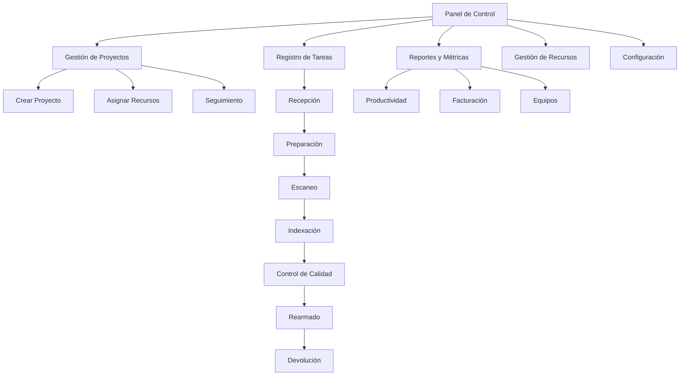

# Documento de Requisitos del Producto - Sistema de Gestión y Seguimiento de Trabajo para Digitalización de Documentos

## 1. Resumen del Producto

Sistema integral para optimizar y centralizar la gestión de proyectos de digitalización de documentos, permitiendo seguimiento detallado desde la recepción hasta la devolución, monitoreando productividad de empleados y uso de equipos escáneres.

- Soluciona la necesidad de control centralizado del proceso de digitalización, mejorando eficiencia y precisión en métricas de rendimiento.
- Dirigido a empresas de digitalización con equipos de trabajo y múltiples escáneres que requieren facturación detallada por proyecto.
- El sistema simplificará la facturación a clientes y optimizará la asignación de recursos en tiempo real.

## 2. Funcionalidades Principales

### 2.1 Roles de Usuario

| Rol | Método de Registro | Permisos Principales |
|-----|-------------------|---------------------|
| Gerente | Registro administrativo | Crear proyectos, asignar recursos, ver reportes completos, gestionar empleados |
| Empleado | Asignación por gerente | Registrar progreso en tareas asignadas, ver sus métricas personales |
| Administrador | Acceso de sistema | Gestión completa de usuarios, configuración de equipos, respaldos |

### 2.2 Módulos de Funcionalidad

Nuestro sistema de gestión de digitalización consta de las siguientes páginas principales:

1. **Panel de Control**: dashboard principal, métricas en tiempo real, estado de proyectos activos.
2. **Gestión de Proyectos**: creación de proyectos, asignación de recursos, seguimiento de progreso.
3. **Registro de Tareas**: control de tiempo, registro de etapas, selección de equipos.
4. **Reportes y Métricas**: informes de productividad, facturación por proyecto, rendimiento de equipos.
5. **Gestión de Recursos**: administración de empleados, configuración de escáneres, asignación dinámica.
6. **Configuración**: parámetros del sistema, roles de usuario, configuración de equipos.

### 2.3 Detalles de Páginas

| Página | Módulo | Descripción de Funcionalidad |
|--------|--------|------------------------------|
| Panel de Control | Dashboard Principal | Mostrar resumen de proyectos activos, métricas del día, alertas de rendimiento |
| Panel de Control | Métricas en Tiempo Real | Visualizar productividad actual por empleado y equipo, estado de escáneres |
| Gestión de Proyectos | Creación de Proyectos | Crear nuevo proyecto con datos del cliente, método de facturación, responsable |
| Gestión de Proyectos | Asignación de Recursos | Asignar empleados y escáneres a tareas específicas, reasignación dinámica |
| Gestión de Proyectos | Seguimiento de Progreso | Monitorear avance por etapa, tiempo invertido, documentos procesados |
| Registro de Tareas | Control de Etapas | Registrar inicio/fin de cada etapa: Recepción, Preparación, Escaneo, Indexación, Control de Calidad, Rearmado, Devolución |
| Registro de Tareas | Registro de Escáneres | Seleccionar equipo, ingresar contador inicial/final, calcular documentos escaneados |
| Registro de Tareas | Control de Tiempo | Registrar horas dedicadas por tarea, especialmente para preparación de documentos |
| Reportes y Métricas | Informes de Productividad | Generar reportes por empleado, equipo, proyecto con métricas detalladas |
| Reportes y Métricas | Facturación por Proyecto | Calcular costos por documento o por hora según método de facturación |
| Reportes y Métricas | Rendimiento de Equipos | Analizar uso y productividad de cada escáner, mantenimiento requerido |
| Gestión de Recursos | Administración de Empleados | Gestionar perfiles de empleados, asignaciones actuales, historial de rendimiento |
| Gestión de Recursos | Configuración de Escáneres | Registrar equipos, contadores actuales, estado operativo |
| Configuración | Parámetros del Sistema | Configurar tarifas de facturación, metas de productividad, alertas |

## 3. Proceso Principal

### Flujo de Trabajo para Gerentes:
1. Crear nuevo proyecto con datos del cliente y método de facturación
2. Asignar empleados y recursos necesarios al proyecto
3. Monitorear progreso en tiempo real desde el panel de control
4. Reasignar recursos según necesidades del proyecto
5. Generar reportes de facturación y rendimiento

### Flujo de Trabajo para Empleados:
1. Acceder a tareas asignadas desde el panel personal
2. Registrar inicio de etapa específica (Recepción, Preparación, etc.)
3. Para escaneo: seleccionar equipo, registrar contadores inicial y final
4. Para otras etapas: registrar tiempo invertido y documentos procesados
5. Marcar finalización de etapa y proceder a la siguiente

### Diagrama de Flujo de Navegación:

## 4. Diseño de Interfaz de Usuario

### 4.1 Estilo de Diseño

- **Colores primarios**: Azul corporativo (#2563eb), Verde éxito (#16a34a)
- **Colores secundarios**: Gris neutro (#64748b), Naranja alerta (#ea580c)
- **Estilo de botones**: Redondeados con sombra sutil, estados hover y active
- **Tipografía**: Inter como fuente principal, tamaños 14px-16px para texto, 18px-24px para títulos
- **Estilo de layout**: Diseño basado en tarjetas con navegación lateral fija
- **Iconos**: Lucide React para consistencia, estilo minimalista

### 4.2 Resumen de Diseño por Página

| Página | Módulo | Elementos de UI |
|--------|--------|----------------|
| Panel de Control | Dashboard Principal | Tarjetas de métricas con iconos, gráficos de barras y líneas, colores de estado |
| Panel de Control | Métricas en Tiempo Real | Indicadores circulares de progreso, badges de estado, tabla responsiva |
| Gestión de Proyectos | Creación de Proyectos | Formulario multi-paso, campos de validación, selector de empleados |
| Gestión de Proyectos | Asignación de Recursos | Drag & drop para asignaciones, vista de calendario, modal de confirmación |
| Registro de Tareas | Control de Etapas | Stepper horizontal, botones de acción primarios, timer visual |
| Registro de Tareas | Registro de Escáneres | Selector de equipos con imágenes, campos numéricos grandes, cálculo automático |
| Reportes y Métricas | Informes | Filtros avanzados, tablas exportables, gráficos interactivos |
| Gestión de Recursos | Empleados | Lista con avatares, badges de estado, modal de edición |
| Configuración | Parámetros | Formulario de configuración con tabs, switches para opciones |

### 4.3 Responsividad

Diseño desktop-first con adaptación completa para tablets y móviles. Navegación lateral se convierte en menú hamburguesa en pantallas pequeñas. Optimización táctil para registro de tareas en dispositivos móviles.